# HRMS Backend API Mind Map

## Mermaid Diagram

```mermaid
mindmap
  root((HRMS Backend API))
    Base_URL["/api/v1"]
      Authentication["/auth"]
        POST_register["POST /register"]
        POST_complete["POST /complete-registration"]
        POST_login["POST /login"]
        POST_logout["POST /logout"]
        POST_refresh["POST /refresh-token"]
        POST_verify["POST /verify-email"]
        POST_forgot["POST /forgot-password"]
        POST_reset["POST /reset-password"]
        POST_resend["POST /resend-otp"]
      Employee_Management["/employees"]
        GET_all["GET / - Get all employees"]
        GET_id["GET /:id - Get by ID"]
        GET_empid["GET /employee-id/:employeeId"]
        POST_create["POST / - Create employee"]
        PUT_update["PUT /:id - Update employee"]
        DELETE_delete["DELETE /:id - Delete employee"]
        GET_dept["GET /department/:departmentId"]
        GET_shift["GET /shift/:shiftId"]
      Departments["/departments"]
        GET_all["GET / - Get all departments"]
        GET_id["GET /:id - Get by ID"]
        POST_create["POST / - Create department"]
        PUT_update["PUT /:id - Update department"]
        DELETE_delete["DELETE /:id - Delete department"]
      Shifts["/shifts"]
        GET_all["GET / - Get all shifts"]
        GET_id["GET /:id - Get by ID"]
        POST_create["POST / - Create shift"]
        PUT_update["PUT /:id - Update shift"]
        DELETE_delete["DELETE /:id - Delete shift"]
      Attendance["/attendance"]
        Punch_In["POST /punch-in"]
        Punch_Out["POST /punch-out"]
        GET_today["GET /today/:employeeId"]
        GET_employee["GET /employee/:employeeId"]
        GET_two_month["GET /employee/:employeeId/two-months"]
        POST_download["POST /employee/:employeeId/download-report"]
        POST_email["POST /employee/:employeeId/send-report-email"]
        GET_all_att["GET /all-employees"]
        GET_summary["GET /summary"]
        Self_Service["Self Service"]
          POST_checkin["POST /check-in"]
          POST_checkout["POST /check-out"]
          POST_break_start["POST /break/start"]
          POST_break_end["POST /break/end"]
          GET_my_today["GET /my-today"]
          GET_my_range["GET /my-range"]
          GET_my_stats["GET /my-stats"]
          GET_leave_bal["GET /leave-balance"]
          GET_calendar["GET /calendar"]
        Biometric["Biometric Sync"]
          POST_sync["POST /biometric/sync/:deviceId"]
          POST_sync_all["POST /biometric/sync-all"]
      Overtime["/overtime"]
        GET_all["GET /"]
        GET_id["GET /:id"]
        POST_create["POST /"]
        PUT_update["PUT /:id"]
        DELETE_delete["DELETE /:id"]
      Regularization["/regularization"]
        GET_all["GET /"]
        GET_id["GET /:id"]
        POST_create["POST /"]
        PUT_update["PUT /:id"]
        DELETE_delete["DELETE /:id"]
      Leave_Management["/leaves"]
        Leave_Requests["Leave Requests"]
          GET_all["GET / - Get all leaves"]
          GET_my["GET /my-requests"]
          GET_pending["GET /my-pending"]
          GET_id["GET /:id"]
          POST_create["POST / - Create leave"]
          PUT_update["PUT /:id - Update leave"]
          PUT_approve["PUT /:id/approve"]
          PUT_reject["PUT /:id/reject"]
          POST_cancel["POST /:id/cancel"]
          GET_balance["GET /balance/:employeeId"]
          GET_approvals["GET /approvals"]
        Holidays["Holidays"]
          GET_all["GET /holidays"]
          GET_id["GET /holidays/:id"]
          POST_create["POST /holidays"]
          PUT_update["PUT /holidays/:id"]
          DELETE_delete["DELETE /holidays/:id"]
        Leave_Types["Leave Types"]
          GET_all["GET /types"]
          GET_id["GET /types/:id"]
          POST_create["POST /types"]
          PUT_update["PUT /types/:id"]
          DELETE_delete["DELETE /types/:id"]
      Performance["/performance"]
        GET_all["GET /"]
        GET_id["GET /:id"]
        GET_employee["GET /employee/:employeeId"]
        POST_create["POST /"]
        PUT_update["PUT /:id"]
        GET_summary["GET /summary"]
        GET_analytics["GET /analytics"]
      KPIs["/kpis"]
        GET_all["GET /"]
        GET_id["GET /:id"]
        POST_create["POST /"]
        PUT_update["PUT /:id"]
        DELETE_delete["DELETE /:id"]
      Reimbursements["/reimbursements"]
        GET_all["GET /"]
        GET_id["GET /:id"]
        POST_create["POST /"]
        PUT_update["PUT /:id"]
        DELETE_delete["DELETE /:id"]
      Payroll["/payroll"]
        GET_all["GET /"]
        POST_process["POST /process"]
        POST_approve["POST /approve"]
        GET_report["GET /report"]
        GET_reimbursement["GET /reimbursement"]
        GET_payslip["GET /payslip"]
        GET_export["GET /export"]
      Payslips["/payslips"]
        GET_all["GET /"]
        GET_id["GET /:id"]
        POST_generate["POST /generate"]
        GET_download["GET /download/:id"]
      Loans["/loans"]
        GET_all["GET /"]
        GET_id["GET /:id"]
        POST_create["POST /"]
        PUT_update["PUT /:id"]
        DELETE_delete["DELETE /:id"]
      Notifications["/notifications"]
        GET_all["GET /"]
        GET_id["GET /:id"]
        POST_create["POST /"]
        PUT_mark_read["PUT /:id/mark-read"]
        DELETE_delete["DELETE /:id"]
      Companies["/companies"]
        GET_all["GET / - Get all companies"]
        GET_stats["GET /stats"]
        GET_id["GET /:id - Get by ID"]
        POST_create["POST / - Create company"]
        PUT_update["PUT /:id - Update company"]
        PATCH_status["PATCH /:id/status"]
        PATCH_admin["PATCH /:id/admin"]
        DELETE_delete["DELETE /:id - Delete company"]
      Users["/users"]
        GET_all["GET /"]
        GET_id["GET /:id"]
        POST_create["POST /"]
        PUT_update["PUT /:id"]
        DELETE_delete["DELETE /:id"]
      Roles["/roles"]
        GET_all["GET /"]
        GET_id["GET /:id"]
        POST_create["POST /"]
        PUT_update["PUT /:id"]
        DELETE_delete["DELETE /:id"]
      Access_Control["/access-control"]
        GET_all["GET /"]
        GET_id["GET /:id"]
        POST_create["POST /"]
        PUT_update["PUT /:id"]
        DELETE_delete["DELETE /:id"]
      Support["/support"]
        GET_all["GET /"]
        GET_id["GET /:id"]
        POST_create["POST /"]
        PUT_update["PUT /:id"]
        DELETE_delete["DELETE /:id"]
      Onboarding["/onboarding"]
        GET_all["GET /"]
        GET_id["GET /:id"]
        POST_create["POST /"]
        PUT_update["PUT /:id"]
        DELETE_delete["DELETE /:id"]
      Offboarding["/offboarding"]
        GET_all["GET /"]
        GET_id["GET /:id"]
        POST_create["POST /"]
        PUT_update["PUT /:id"]
        DELETE_delete["DELETE /:id"]
      New_Joining["/newjoining"]
        GET_all["GET /"]
        GET_id["GET /:id"]
        POST_create["POST /"]
        PUT_update["PUT /:id"]
        DELETE_delete["DELETE /:id"]
      Recruitment["/recruitment"]
        Jobs["Jobs"]
          GET_all["GET /jobs"]
          GET_id["GET /jobs/:id"]
          POST_create["POST /jobs"]
          PUT_update["PUT /jobs/:id"]
          DELETE_delete["DELETE /jobs/:id"]
        Candidates["Candidates"]
          GET_all["GET /candidates"]
          GET_id["GET /candidates/:id"]
          POST_create["POST /candidates"]
          PUT_update["PUT /candidates/:id"]
          DELETE_delete["DELETE /candidates/:id"]
        Interviews["Interviews"]
          GET_all["GET /interviews"]
          GET_id["GET /interviews/:id"]
          POST_create["POST /interviews"]
          PUT_update["PUT /interviews/:id"]
      Assets["/assets"]
        Asset_Management["Asset Management"]
          GET_all["GET /"]
          GET_id["GET /:id"]
          POST_create["POST /"]
          PUT_update["PUT /:id"]
          DELETE_delete["DELETE /:id"]
        Inventory["Inventory"]
          GET_all["GET /inventory/all"]
        Assignment["Assignment"]
          POST_assign["POST /:id/assign"]
      Reports["/reports"]
        GET_attendance["GET /attendance"]
        GET_leave["GET /leave"]
        GET_performance["GET /performance"]
      Mobile["/mobile"]
        Push_Notifications["Push Notifications"]
          POST_register["POST /register-device"]
          POST_unregister["POST /unregister-device"]
          POST_send["POST /send-push"]
          GET_devices["GET /devices/:userId"]
        GPS_Location["GPS Location"]
          POST_verify["POST /verify-location"]
          GET_allowed["GET /allowed-locations"]
          POST_add_allowed["POST /allowed-locations"]
          DELETE_remove["DELETE /allowed-locations/:id"]
          POST_checkin_loc["POST /check-in-with-location"]
          POST_checkout_loc["POST /check-out-with-location"]
        Offline_Sync["Offline Sync"]
          GET_pending["GET /sync/pending-actions/:userId"]
          POST_upload["POST /sync/upload-offline-data"]
          GET_last_sync["GET /sync/last-sync/:userId"]
          POST_complete["POST /sync/mark-complete"]
          GET_offline_data["GET /sync/offline-data/:userId"]
        Dashboard["Dashboard"]
          GET_emp_dash["GET /dashboard/employee/:userId"]
          GET_hr_dash["GET /dashboard/hr-manager/:userId"]
          GET_stats["GET /stats/:userId"]
        Mobile_Attendance["Mobile Attendance"]
          GET_today_status["GET /attendance/today-status/:userId"]
          GET_weekly["GET /attendance/weekly-summary/:userId"]
          GET_monthly["GET /attendance/monthly-summary/:userId"]
          GET_records["GET /attendance/records/:userId"]
        Mobile_Leave["Mobile Leave"]
          GET_balance["GET /leave/balance/:userId"]
          GET_holidays["GET /leave/upcoming-holidays"]
        Mobile_Payslip["Mobile Payslip"]
          GET_recent["GET /payslips/recent/:userId"]
          GET_download["GET /payslips/download/:id"]
      Biometric["/biometric"]
        Device_Management["Device Management"]
          POST_register["POST /devices"]
          GET_all["GET /devices"]
          GET_id["GET /devices/:deviceId"]
          PUT_update["PUT /devices/:deviceId"]
          DELETE_delete["DELETE /devices/:deviceId"]
        Device_Connection["Device Connection"]
          POST_connect["POST /devices/:deviceId/connect"]
          POST_disconnect["POST /devices/:deviceId/disconnect"]
          POST_test["POST /devices/:deviceId/test"]
        Device_Info["Device Info"]
          GET_info["GET /devices/:deviceId/info"]
          GET_users["GET /devices/:deviceId/users"]
          GET_logs["GET /devices/:deviceId/logs"]
        Attendance_Sync["Attendance Sync"]
          POST_sync["POST /devices/:deviceId/sync"]
          POST_sync_range["POST /devices/:deviceId/sync/range"]
          POST_sync_all["POST /sync-all"]
      Public["/public"]
        GET_health["GET /health"]
        GET_root["GET /"]
```



## API Structure Summary

### Base URL
- **Production**: `https://api.hrms.com/api/v1`
- **Development**: `http://localhost:3000/api/v1`

### Main Modules

1. **Authentication** - User registration, login, password management
2. **Employee Management** - CRUD operations for employees, departments, shifts
3. **Attendance Management** - Punch in/out, biometric sync, attendance reports
4. **Leave Management** - Leave requests, holidays, leave types, approvals
5. **Performance Management** - Performance reviews, KPIs, analytics
6. **Payroll Management** - Payroll processing, payslips, loans, reimbursements
7. **Company Management** - Company settings, subscriptions, admin assignment
8. **User & Role Management** - User accounts, roles, access control
9. **Recruitment** - Jobs, candidates, interviews
10. **Asset Management** - Asset tracking, inventory, assignment
11. **Mobile APIs** - Push notifications, GPS location, offline sync, mobile dashboard
12. **Biometric Integration** - Device management, connection, attendance sync
13. **Reports** - Attendance, leave, performance reports
14. **Support** - Support tickets and management
15. **Onboarding/Offboarding** - Employee lifecycle management

### Authentication
- All routes (except `/auth` and `/public`) require authentication via JWT tokens
- Use `Authorization: Bearer <token>` header

### Response Format
```json
{
  "success": true,
  "data": {},
  "message": "Operation successful"
}
```

### Error Handling
```json
{
  "success": false,
  "error": "Error message",
  "code": 400
}
```
